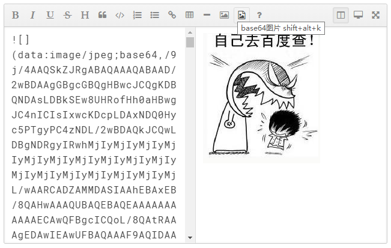

# vue2-mditor

> 支持 Vue 的简洁 markdown 文本编辑器

> 内部基于 [mditor](https://github.com/daidaitu1314/mditor) 并进行了改造，从而允许插入 base64 格式图片


## Capture


## Requirements
[vue](https://github.com/vuejs/vue)

## Installation
npm i vue2-mditor -S

## Usage
1. 在需要的 `.vue` 组件中，导入 `vue2-mditor` 编辑器：
    ```
    import editor from "vue2-mditor";
    ```
2. 使用组件的 `components` 属性，将 `editor` 注册为私有组件：
    ```
    components: {
      editor
    }
    ```
3. 将注册的组件名称，以标签形式，引入到对应的`template` 中即可：
    ```
    <editor :initVal="'**hello world**'" ref="editor"></editor>
    ```
4. 初始化文本：为属性绑定 `:initVal` 提供字符串的值，来初始化编辑器的文本内容：
    ```
    <editor :initVal="'**这是初始化的文本内容**'"></editor>
    ```
5. 获取原始的 `markdown` 文本
    + 添加 `ref` 属性：
      ```
      <editor ref="editor"></editor>
      ```
    + 使用 `$refs.引用名称.getValue()` 获取文本值：
      ```
      methods: {
        getVal() {
          // 点击按钮，获取编辑器的数据
          var txt = this.$refs.editor.getValue();
          console.log(txt);
        }
      }
      ```


## Examples
```
<template>
  <div>
    <!-- 3. 以标签形式在页面上使用组件 -->
    <!-- :initVal="'**hello world**'" 为初始化的数据 -->
    <!-- ref 为组件的实例，专门用来调用实例上的方法的 -->
    <editor :initVal="'**hello world**'" ref="editor"></editor>

    <hr>
    <input type="button" value="获取文本框的值" @click="getVal">

    <h3>获取到的值为：</h3>
    <div style="font-size: 12px; width: 100%; word-break:break-all;">{{ msg }}</div>
  </div>
</template>

<script>
// 1. 导入 编辑器
import editor from "vue2-mditor";

export default {
  data() {
    return {
      msg: ""
    };
  },
  methods: {
    getVal() {
      // 点击按钮，获取编辑器的数据
      console.log(this.$refs.editor.getValue());
      this.msg = this.$refs.editor.getValue();
    }
  },
  components: {
    editor // 2. 注册为私有组件
  }
};
</script>

<style scoped></style>
```
> 也可以直接在下载的项目根目录中，先运行 `npm i`，再运行 `npm run dev` 查看项目效果

## License
